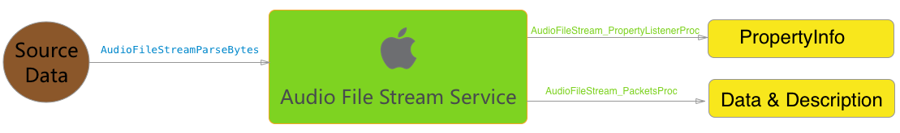

# 4.1.3 读取流式音频数据
在App的使用中，有的时候会遇到这样的场景，音频文件不是本地的文件，而是从网络下载的流文件，比如现在的FM 类APP，或者音乐播放从网上搜索到语音点击播放后，不等到先下载完再播放，而是下载了部分数据后就开始播放了。对于这种场景，最麻烦的是音频数据的处理需要按照Packet来处理，甚至要根据不同过的文件格式解析头上的Meaa信息，还好Apple为这种场景提供了一套处理读取流式音频数据的接口。

这套接口首先往"AuidoFileStream"里面塞源文件数据，然后其会对数据做相关的处理，当得到完整的Meta信息或者完整的Packet数据后，做相关回调将解析的内容给到用户在做和从文件读出Packet一样的操作：

图中函数即为塞入数据和回调的接口。

## 创建流处理器对象
创建流处理器对象需要先提供上门说的得到Meta和数据信息的回调，这个我们列在后面，先来看创建：

	OSStatus AudioFileStreamOpen ( void *inClientData, AudioFileStream_PropertyListenerProc inPropertyListenerProc, AudioFileStream_PacketsProc inPacketsProc, AudioFileTypeID inFileTypeHint, AudioFileStreamID _Nullable *outAudioFileStream );
	
第一个void *参数是C里一般使用模式，相当于C++里面的self最后会透传给回调（注意后面的回调第一个参数也都是这个void *）。然后是两个回调的实现，接着是一个前面有结果的hint文件类型提示，一般传递0就可以了，最后对象结果在outAudioFileStream中返回。

比如：

	AudioFileTypeID hint = kAudioFileAIFFType;
	OSStatus stts;
	stts = AudioFileStreamOpen((__bridge void * _Nullable)(self), audioFileStream_PropertyListenerProc, audioFileStream_PacketsProc , hint, &streamID_);
	VStatus(stts, @"AudioFileStreamOpen");
	
这里VSStatus依旧是个检查的返回值的宏。

## 填充数据
有了流处理器对象,就可以往里面填充数据了，比如这里我们填充一个本地文件：

	NSFileHandle *audioFD;
	NSString *audioURL = [[NSBundle mainBundle] pathForResource:@"01" ofType:@"caf"];
	audioFD = [NSFileHandle fileHandleForReadingAtPath:audioURL];
	if (nil == audioFD) {
	    NSLog(@"audio fd is null");
	    return ;
	}
	NSLog(@"open audio fd success ");
	
	for (;;) {
	    NSData *cntnt = [audioFD readDataOfLength:1024];
	    if (NULL == cntnt || 0 == [cntnt length]) {
	        NSLog(@"Read EOF!");
	        break ;
	    }
	    NSLog(@"[%@]have read %lu", [NSThread currentThread], (unsigned long)[cntnt length]);
	    OSStatus stts;
	    stts = AudioFileStreamParseBytes(streamID_, (UInt32) [cntnt length], [cntnt bytes], 0);
	    VStatus(stts, @"AudioFileStreamParseBytes");
	}
这里读取文件内容后，调用了：

	OSStatus AudioFileStreamParseBytes ( AudioFileStreamID inAudioFileStream, UInt32 inDataByteSize, const void *inData, AudioFileStreamParseFlags inFlags );
塞数据，函数原型比较好理解，就是往流处理器inAudioFileStream里面塞入inDataByteSize字节数据，这里有个flag控制比较关键。正常情况下传0就可以了，比如我们从文件里面读数据的时候，但是比如我们在处理网络流的时候，中间断了一截数据，现在要 从后一段数据来开始播放，那这个flag就有作用了，将其设置成"kAudioFileStreamParseFlag_Discontinuity"就可以正常播放了。

## 处理回调
经过了这么多处理，最终的数据会通过回调给我们，就如同在用"AudioFileReadPacketData"读取文件一样。主要有两个回调

### typedef void (*AudioFileStream_PropertyListenerProc) ( void *inClientData, AudioFileStreamID inAudioFileStream, AudioFileStreamPropertyID inPropertyID, UInt32 *ioFlags );

流处理器从源数据涨处理出了AudioFileStreamPropertyID指向的内容，此时可以通过调用“AudioFileStreamGetPropertyInfo”和“AudioFileStreamGetProperty”来获取相关的属性。

这里flags别标记为io，当其为0时表示不缓存属性值，此时通过设置其为kAudioFileStreamPropertyFlag_CacheProperty，这样来控制缓存策略。

### typedef void (*AudioFileStream_PacketsProc) ( void *inClientData, UInt32 inNumberBytes, UInt32 inNumberPackets, const void *inInputData, AudioStreamPacketDescription *inPacketDescriptions );

流处理器从源数据中处理出来一个个Packet数据，其总共有inNumberPackets个包，总长inNumberBytes个字节，数据放在inInputData指向的内存中，每个Packet的数据格式依次在inPacketDescriptions数组中。

## 获取属性

## 总结
Audio File Stream Service提供了一种将二进制文件做音频文件解析并提供Meta信息和音频包信息的途径，通过这个工具，我们既可以播放网络上的音频流数据，同时也为对本地文件异步读取先加载再处理提供了一种解决方案，基于此可以封装一套读取所有种类音频的接口。

## 参考
1. [Audio File Stream Services Reference](https://developer.apple.com/library/mac/documentation/MusicAudio/Reference/AudioStreamReference/index.html#//apple_ref/doc/constant_group/Audio_File_Stream_Flags)
2. [Extended Audio File Services Reference](https://developer.apple.com/library/mac/documentation/MusicAudio/Reference/ExtendedAudioFileServicesReference/index.html#//apple_ref/doc/uid/TP40007912)
3. [NSFileHandle Class Reference](https://developer.apple.com/library/ios/documentation/Cocoa/Reference/Foundation/Classes/NSFileHandle_Class)