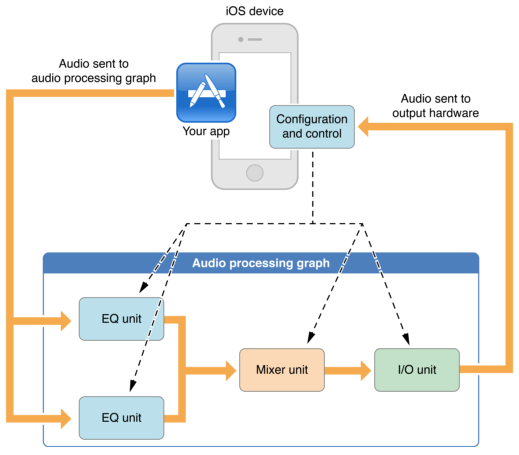

# 低延时的Audio Unit
在OS X(macOS)上面，Audio Unit绝对是个主角，用来对这种硬件扩展进行低延迟的音频采集等功能，而在iOS上，则是一个比较底层的接口，后面说的OpenAL也是基于Audio Unit进行采集和播放的，可以近似的认为Audio Unit就是对硬件驱动的封装，通过他获取麦克风采集的音频数据或者将数据通过他送到扬声器进行播放。
一般情况下比如播放背景音，直接使用MediaPlayer或者AVAudioPlayer就可以了，AudioUnit在iOS上主要用于对时延要求比较高的场景，比如实时语音、VoIP的场景。

使用Audio Unit主要有两大优势：
* 最快的反应速度，从采集到播放回环可以到10ms的级别。
* 动态的配置，AUGraph可以动态的进行组合，满足各种需求。

也注定了其一般用于实时语音、乐器录音等场景。

Audio Unit描述的是各个Unit，为了使其可以完成一系列的效果，需要把各个Unit通过一个“Audio Processing Graph”（简称AUGraph）组合起来形成一个类似责任链的模式，音频数据依次流过每个Unit，最终输出出来。如下图这样：

两路音频数据首先经过EQ(均衡器)单元，然后再经过混音单元（Mixer Unit）混合成一路后，最后经由I/O（I/O Unit）输出到扬声器。

Audio Unit作为处理音频数据最直接的单元，但是缺少对系统上下文的控制，因此还要配合AudioSession进行系统上下文控制。所以使用AudioUnit的步骤如下：
1. 配置应用的AudioSession，从而控制当前App的系统和硬件设备上下文，比如如何响应系统中断、耳机插入事件等。
2. 更具应用场景，设计一种模式，构建一个Audio Processing Graph(AUGraph)。
3. 提供一个UI界面或者其他接口来控制AUGraph中的Audio Unit。

## 参考
1. [Audio Unit Hosting Guide for iOS](https://developer.apple.com/library/ios/documentation/MusicAudio/Conceptual/AudioUnitHostingGuide_iOS/Introduction/Introduction.html)
2. [iOS Audio Unit Graph By GENE DE LISA ](http://www.rockhoppertech.com/blog/ios-audio-unit-graph/)