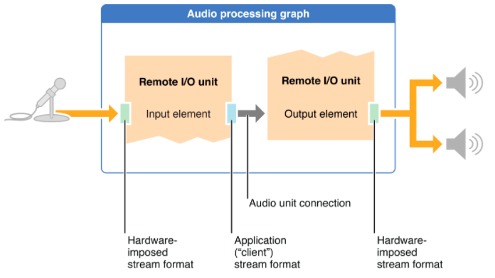

# 本地回环Demo
前面说了那么多理论知识和接口说明，实在太枯燥了。这里我们来看一个本地回环Demo，效果如下图：

在Demo中点击麦克风按钮，Demo就开始打开麦克风开始采集，而点击扬声器则会打开扬声器开始播放刚刚采集的声音，效果就跟TOM猫类似。

实现步骤如下：

1. 配置AudioSession， 和其他使用功能一样，需要用AudioSession配置录音和播放环境
2. 使用AudioStreamBasicDescription配置AudioComponentDescription
3. 创建AUGraph并添加节点
4. 获取AUGraph中的节点并进行配置。
5. 连接各个节点
6. 控制AUGraph开启和停止

## 构建AUGraph
在使用AudioUnit前，需要根据需求设计好处理的图。也就是AUGraph，这里我们主要需要一个采集节点，一个播放节点，然后串起来，采集节点的输出连接到播放节点的输入节点。如下图：

首先创建AUGraph，然后增加两个节点:

	    NewAUGraph (&_processingGraph);
    _micDesc.componentType = kAudioUnitType_Output;
    _micDesc.componentSubType = kAudioUnitSubType_RemoteIO;
    _micDesc.componentManufacturer = kAudioUnitManufacturer_Apple;
    _micDesc.componentFlags = _micDesc.componentFlagsMask = 0;
    
    _speakerDesc.componentType = kAudioUnitType_Output;
    _speakerDesc.componentSubType = kAudioUnitSubType_RemoteIO;
    _speakerDesc.componentManufacturer = kAudioUnitManufacturer_Apple;
    _speakerDesc.componentFlags = _speakerDesc.componentFlagsMask = 0;
    
    
    AUGraphAddNode(_processingGraph, &_micDesc, &_micNode);
    AUGraphAddNode(_processingGraph, &_speakerDesc, &_speakerNode);
    
    AUGraphOpen (_processingGraph);
    
然后在获取每个Node并设置其属性：

## 实现回调

## 连接节点

## 总结
这里我们通过构建一个Demo来模拟了如何使用AudioUnit进行采集和播放，在使用之前需要根据场景设计一个使用图，可以参考[Audio Unit Hosting Guide for iOS](https://developer.apple.com/library/content/documentation/MusicAudio/Conceptual/AudioUnitHostingGuide_iOS/ConstructingAudioUnitApps/ConstructingAudioUnitApps.html#//apple_ref/doc/uid/TP40009492-CH16-SW1)中开始的三种模式，一般就是既有采集又有播放的如我们的Demo；或者只有播放的比如一个MP3播放器，后面我们会介绍；又或者可以收集各种乐器的MIDI应用。设计好了数据流图后就可以开始构建图了，并设置好各个节点的属性以及回调函数。

## 参考

1. [Audio Unit Hosting Guide for iOS](https://developer.apple.com/library/content/documentation/MusicAudio/Conceptual/AudioUnitHostingGuide_iOS/ConstructingAudioUnitApps/ConstructingAudioUnitApps.html#//apple_ref/doc/uid/TP40009492-CH16-SW1)
2. [Audio Component Services](https://developer.apple.com/reference/audiounit/1653552-audio_component_services)
3. [Audio Unit Component Services](https://developer.apple.com/reference/audiounit/1653800-audio_unit_component_services)
4. [Output Audio Unit Services](https://developer.apple.com/reference/audiounit/1651082-output_audio_unit_services)

	
	

