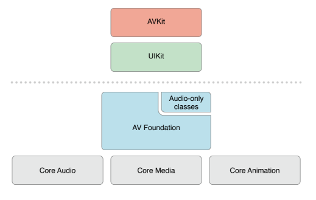

# AVFoundation中的Audio部分
AVFoundation是iOS提供的一个Objective-C接口的播放和创建音视频的framework集。和其他提供C接口工具不同（OpenAL/AudiotoolBox）的是，AVFoundation提供了Objective-C接口（因此也就有了类似的Swift接口）。其底层依赖AudioToolBox、AudioUnit等其他CoreAudio组件，对上提供了AVKit/UIKit支持。既然其起名为“AV”，自然是既可以处理音频又可以处理视频，其中音频有一小块独立的API来实现，也就是我们后面主要介绍的内容。先来看下其位于系统中的结构：

