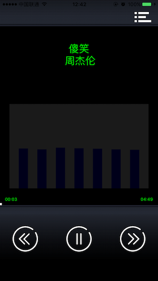

# 使用AVAudioPlayer播放音频
在iOS上如果想播放一段音频数据，最简单的方法就是使用AVFoundation.framework提供的AVAudioPlayer了。接口简单，效果又强大，性价比极高。

使用AVAudioPlayer可以对音频文件或者音频NSData数据进行播放，比如来自网络上的音频流数据，并支持iOS系统支持的所有音频格式，iOS系统格式参见[Supported Audio File and Data Formats in OS X](https://developer.apple.com/library/content/documentation/MusicAudio/Conceptual/CoreAudioOverview/SupportedAudioFormatsMacOSX/SupportedAudioFormatsMacOSX.html)。其提供的接口可以实现：

* 控制循环播放
* 快进回播
* 音频速率
* 获取音频能量大小
* 获取资源文件时长
等，更厉害的时，通过他还可以实现多个音频文件的混音播放，并可以进行同步设置。

## 1. 播放器 Demo
先看一个例子，一个模拟播放器。

 

Demo的代码可以在[GitHub](https://github.com/cz-it/play_and_record_with_coreaudio/tree/master/avfoundation/examples/AVAudioPlayerDemo)进行下载。

从上面的截图可以看到，Demo演示了，播放一首歌并提供了快进、回播、暂停、时长显示、能量波图等AVAudioPlayer提供的功能。

## 2. 使用AVAudioPlayer播放一段音频
AVAudioPlayer的使用，需要先用音频数据进行初始化，在初始化的过程AVAudioPlayer会对数据进行解析。既可以从文件中直接读取，也可以是从网上下载并用NSData存储的一段数据，分别对应：

	- (instancetype)initWithContentsOfURL:(NSURL *)url 
                                	  error:(NSError * _Nullable *)outError;
	- (instancetype)initWithData:(NSData *)data 
                          error:(NSError * _Nullable *)outError;
比如demo中的：

    NSError *error = nil;
    if (nil != _furl) {
        _player = [_player initWithContentsOfURL:_furl error:&error];
        if (nil != error) {
            NSLog(@"initWithContentsOfURL error:%@", error.localizedDescription);
            return ;
        }
    }  
这里首先通过MediaPlaer.framework（参考[获取iPod资源信息](../mediaplayer/ipod.html)中的章节）获得了一个iTunes里面的音乐文件的路径，然后给到AVAudioPlayer进行音频的初始化，如果格式不支持或者其他错误，会通过这里的outError反馈出来。

如果没有其他特殊需求，这个时候就可以用音频数据初始化后的AVAudioPlayer进行播放了。改对象提供了一组播放器方法

播放器方法| 函数签名| 作用
---|---|---
prepareToPlay| - (BOOL)prepareToPlay; | 准备状态取播放，也可以不调用，调用play的时候会自动执行
play| - (BOOL)play; | 开始播放音频，如果调用pause，再次调用play的时候会自动记录上次播放的位置
pause| - (void)pause; | 暂停播放，会记录播放的状态
stop| - (void)stop; | 停止播放，不会记录播放状态

这一列方法，基本上就组件了一个播放器基本的功能了。可以实现Demo中中间的那个“Play”按钮。

这里的play是个异步接口，调用后会立即返回，由系统去进行音乐的播放。最后如果没有调用stop的话，什么时候播放结束了呢？由于播放是异步进行的，所以AVAudioPlayer还提供了一个delegate：AVAudioPlayerDelegate 来获取播放错误或者结束的信息，其接口有：

	- (void)audioPlayerDidFinishPlaying:(AVAudioPlayer *)player 
                          successfully:(BOOL)flag;
	- (void)audioPlayerDecodeErrorDidOccur:(AVAudioPlayer *)player 
                                     error:(NSError *)error;                        
                                     

`audioPlayerDidFinishPlaying:successfully:`在成功播放结束后被调用，播放结束有成功播放到文件结束和中途解码出错两种情况，如果解码出错还会调用`audioPlayerDecodeErrorDidOccur:error:`，error里面包含了具体的出错信息。

有了这几个接口就可以用AVAudioPlayer完成段音频的播放了。

##3. 播放器控制
AVAudioPlayer提供了一系列的属性，来控制播放器的表现。比如

属性|类型|作用
---|---|---
volume|float| 音量大小，范围[0.0, 1.0]是一个比例范围0表示静音，可以认为是相对系统当前一辆的比例，默认是1.0
pan| float| 立体音位置，-1.0表示完全的左声道，0.0表示正中间，1.0表示完全的右声道
enableRate|BOOL| 是否允许调整播放速率
meteringEnabled| BOOL | 是否开启能量统计的开关
numberOfLoops|NSInteger|播放的循环次数，0（默认）表示不循还，只播放一次，负数表示无限循环，正数表示循环几次，比1会播放两次（一次原本的，一次循环的）

这个几个属性在play之前init之后进行调用，可以控制播放器的相当声音，左右声道，是否运行设置播放速率以及是否运行设置能量开关。在打开这几个开关后，才可以进行进一步的控制。

属性|类型|作用
---|---|---
playing| BOOL(readonly)| 是否在播放音频
rate| float| 播放速率，1.0表示正常速度，0.5表示减半速度播放，2.0表示加速一倍播放，需要打开enalbeRate开关
numberOfChannels|NSUInteger(readonly)| 通道数
channelAssignments |NSArray<NSNumber *>*| 一个数组，每个成员表示每个通道的描述 AVAudioSessionChannelDescription
duration|NSTimeInterval(readonly)| 音频文件持续的时长（单位是秒）
currentTime|NSTimeInterval| 当前播放时长，比如MP3上显示的进度

`playing`标记了当前是否在播放状态，是个只读变量；通过设置rate的值，可以修改播放速率；numberOfChannels通道数也是只读变量语气对应的channelAssignments可以查看每个通道音频数据的格式信息。

这里duration表示音频总时长，单位秒，而currentTime表示当前时长，通过设置currentTime可以改变当前播放位置。有了这两个属性我们就可以制作Demo中的播放条了。

1. 通过duration转换成分钟表示总长度
2. 通过currentTime转换成分钟，在进度条上显示出当前播放进度
3. 当快进时，设置一个步长，加到当前时间上在设置回currentTime就可以从新的位置开始播放了
4. 同样的当后退时，用当前时间减去一个步长，再设置回currentTime就可以从新的位置开始播放了

参考Demo代码：

	- (IBAction)onForward:(id)sender {
	    static float step = 0.05;
	    NSTimeInterval newCur = _player.currentTime + _player.duration*step;
	    _player.currentTime = newCur;
	}
	
	- (IBAction)onBackward:(id)sender {
	    static float step = 0.05;
	    NSTimeInterval newCur = _player.currentTime - _player.duration*step;
	    if (newCur<0) {
	        newCur = 0;
	    }
	    _player.currentTime = newCur;
	}

配合上面的播放，播放器的核心功能基本就完成了，那么Demo的中的声波图是怎么实现的呢？AVAudioPlayer还提供了获取声音能量的接口

函数原型|作用
---|---
(float)averagePowerForChannel:(NSUInteger)channelNumber|所指通道上的平均能量值，需要配合meteringEnabled使用
(float)peakPowerForChannel:(NSUInteger)channelNumber| 所指通道上当前的能量峰值， 需要配合meteringEnabled使用

使用前需要打开上面的meteringEnabled，同时在每次调用前要先调用`- (void)updateMeters;`。然后才能获得声音的能量值。不过这里有个非常奇怪的现象就是[文档](https://developer.apple.com/reference/avfoundation/avaudioplayer?language=objc)中说范围是-160dB-0dB和常理非常不符合，经过测试，歌曲得到的一般在-4dB--20dB之间。

通过这个值，将其进行曲线展示就可以得到一个波动的柱状图了。

**注意**
> 如果看过官方的手册[AVAudioPlayer Manual](https://developer.apple.com/reference/avfoundation/avaudioplayer?language=objc),可能会对其中的一个借口比较迷惑：
>
>	- (BOOL)playAtTime:(NSTimeInterval)time;
>
> 直观的会认为通过这个接口可以设置从哪里开始播放，应该是Seek的作用。但实际上却不是这样,Seek是通过设置currentTime来实现的，而这个接口的作用实际上上延迟播放，其参数不是延迟多久，而是一个时刻，一个相当于设备启动的时刻，可以认为是一个绝对时间，其可以通过另一个属性获得`deviceCurrentTime`。

那这两个接口的意义是什么呢？一个绝对时间，那最容易想到的就是同步问题了。是的，这个主要就是用来做同步的，比如两个AVAudioPlayer要同时播放两段声音从而让他们形成混音，那如何同时呢？就可以在这里通过`- playAtTime:`延迟到指定时间同时播放。既然是延迟，那么这个值就不能低于当前的`deviceCurrentTime `

##3. 被Deprecate的Delegate

在最原始的版本中，AVAudioPlayerDelegate总共有6个回调，在iOS6.0中废弃掉两个，然后在iOS8.0又废掉两个。马上iOS 10就要出来，距离不用兼容iOS7的日子估计也不远了（LinkedIn现在(20160501)就要求iOS8.0以上了），因此只需要关注这最后存活下来的回调即可。在以前的版本中被抛弃的回调接口，主要是控制播放器在播放的过程中收到中断

比如，收到中断：

	- (void)audioPlayerBeginInterruption:(AVAudioPlayer *)player;
当中断结束时：
	- (void)audioPlayerEndInterruption:(AVAudioPlayer *)player 
                       withOptions:(NSUInteger)flags;
	- (void)audioPlayerEndInterruption:(AVAudioPlayer *)player;
	- (void)audioPlayerEndInterruption:(AVAudioPlayer *)player 
                         withFlags:(NSUInteger)flags;
这里不对这些函数做说明了，都已经不再推荐使用。但是要知道这里的中断基本上都是表示一些打断音频部分的流程，我们该做些什么，比如来电话了，锁屏了。那新时代的我们改如何操作呢？答案是：

> 配合AVAudioSession进行播放控制

正常使用AVAudioPlayer的时候，对于系统的响应是符合正常使用场景的：

* 当按下Home键切换App或者来电话甚至锁屏的时候，会暂停音乐的播放，当切换回来的时候，会自动继续播放。
* 当切换静音键到静音状态时，播放也会被静音。
* 当插入耳机的时候，播放的声音会自动从耳机中播放出来

但如果不希望其按照默认的方式表现的话，改怎么办呢？比如锁屏后还希望音乐继续播放！

此时就需要通过AVSession来控制收到中断以及改变输入/输出时的表现了。通过订阅AVSession的`AVAudioSessionInterruptionNotification`来判断中断了还是恢复了，通过订阅`AVAudioSessionRouteChangeNotification`来监控是否有耳机插入等

* AVAudioSessionInterruptionNotification： 
	当中断时，userInfo中会有“ AVAudioSessionInterruptionTypeBegan” 这个成员，如果是恢复回来，则是"AVAudioSessionInterruptionTypeEnded"

* AVAudioSessionRouteChangeNotification ：
	userInfo中包括了“ AVAudioSessionRouteChangeReasonKey”改变原因和 “AVAudioSessionSilenceSecondaryAudioHintTypeKey”表示改变的目标。

关于AVAudioSession的使用，可以参考[使用AVAudioSession管理上下文](../avfoundation/avaudiosession.html)。

##5. 总结
总的来说，使用AVAudioPlayer播放声音是App中首要的选择方案，比如背景音、试听等场景。其使用简单，基本功能都有，既可以播放本地文件，也可以播放从网络上下载到内存中的音频内容。 
但是对于实时流的播放，则有点力不从心，当然也可以一段数据一段数据的去播，不过CoreAudio还为我们提供了其他解决方案，比如后面介绍的AudioQueueService。

##参考文档
1. [AVAudioPlayer Class Reference](https://developer.apple.com/library/ios/documentation/AVFoundation/Reference/AVAudioPlayerClassReference/#//apple_ref/occ/instm/AVAudioPlayer/updateMeters)
2. [Audio Session Programming Guide](https://developer.apple.com/library/ios/documentation/Audio/Conceptual/AudioSessionProgrammingGuide/HandlingAudioInterruptions/HandlingAudioInterruptions.html#//apple_ref/doc/uid/TP40007875-CH4-SW1)

