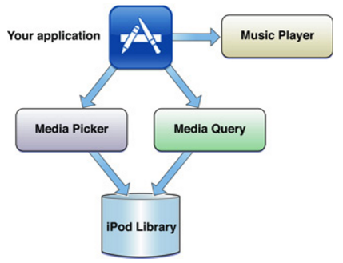
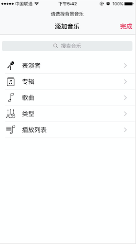
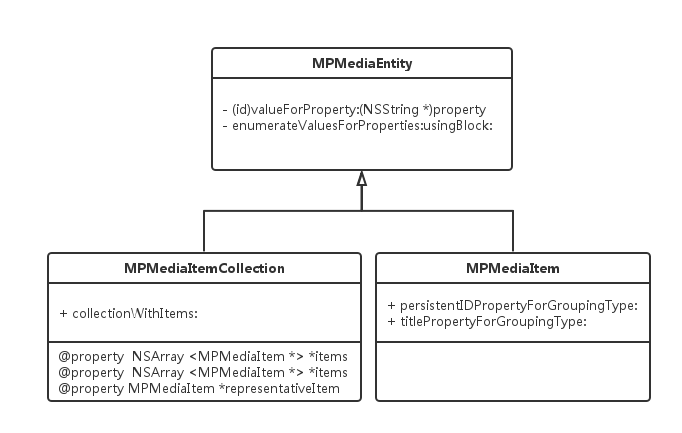

# 获取iPod资源信息
要想获取手机中已经存在的歌曲或者其他如录音音频数据，可以通过MediaPlayer工具。MediaPalyer不仅可以获取音频还可以获取视频信息。不过这里的音视频只能是iPod中可以访问的数据，也就是系统应用“音乐”中的数据。

MediaPlayer提供了两种获取音乐数据文件的方式：

如图，应用App通过MediaPlayer接口可以走左边的线路（Media Picker）提供的一个音乐选择文件界面选择需要的音乐；也可以通过右边线路（Media Query）罗列并查询具体文件列表的方式获取需要的文件信息。

在获得语音文件后就可以交由其他播放工具比如MediaPlayer进行播放了。

## 使用MPMediaPickerController提供的界面选择
一帮当使用一些可以设置背景音的App的时候，通常都是有一个设置背景音的菜单按钮，然后点击一下就弹出一个系统音乐的选择界面

而且稍加注意，会发现大部分App的这个界面基本是类似的。为什么呢？

原因是这个界面其实是系统提供的标准界面，所以只要是调用的系统的这个接口，得到的基本都是一样的界面。那这个接口是怎样的呢？请继续阅读。

MediaPlayer提供了一个“MPMediaPickerController”用来表示系统的音乐选择界面。创建后使用普通的ViewController切换方法即可。如下代码：

	MPMediaPickerController *mpPickerVC = [[MPMediaPickerController alloc] initWithMediaTypes: MPMediaTypeAnyAudio];
	[self presentViewController:mpPickerVC animated:YES completion:^{
        //
    }];
    
这里很常规的用 alloc+init创建一个MPMediaPickerController对象。Init的时候给了一个类型参数`MPMediaTypeAnyAudio`表示所有音频。其他还有：

枚举值| 意义
---|---
MPMediaTypeMusic| 歌曲音乐
MPMediaTypePodcast | 播客音乐
MPMediaTypeAudioBook| 有声电子书
MPMediaTypeAudioITunesU| 包括iTunesU资源
MPMediaTypeAnyAudio| 所有音频资源

函数原型如下：

	- (instancetype)initWithMediaTypes:(MPMediaType)mediaTypes
	
`presentViewController:`就可以看到上面弹出来的选择界面了。那如何获得用户选择的内容呢？对于这样的界面选择结果不用想也知道Apple肯定是用个Delegate来处理的。

	@protocol MPMediaPickerControllerDelegate<NSObject>
	@optional
	
	- (void)mediaPicker:(MPMediaPickerController *)mediaPicker didPickMediaItems:(MPMediaItemCollection *)mediaItemCollection; // 单选择了音乐条目后调用
	- (void)mediaPickerDidCancel:(MPMediaPickerController *)mediaPicker; // 当点击取消按钮时调用
	@end
	
这里回调中的两个回调有两种情况：
* 通过设置MPMediaPickerController的allowsPickingMultipleItems为YES时，可以选择多个音乐条目。此时界面上面没有“取消”按钮，取而代之的是“完成”按钮。点击音乐条目不会触发回调，点击"完成"后会调用`(void)mediaPicker:(MPMediaPickerController *)mediaPicker didPickMediaItems:(MPMediaItemCollection *)mediaItemCollection;`
* 通过设置MPMediaPickerController的allowsPickingMultipleItems为NO时，只能选择单个音乐条目。此时界面上面有“取消”按钮，点击取消会调用`- (void)mediaPickerDidCancel:(MPMediaPickerController *)mediaPicker;`，点击音乐条目会调用`	- (void)mediaPicker:(MPMediaPickerController *)mediaPicker didPickMediaItems:(MPMediaItemCollection *)mediaItemCollection;`

如果不实现上面的回调，那么默认的效果是点击“取消”或者“完成”选择界面会消失并回调之前的界面中，如果实现了上面的回调，那么就需要手动调用"dismissViewControllerAnimated"进行切换了。

另外还可以通过设置MPMediaPickerController的一些控制属性，比如：
* BOOL showsCloudItems属性：控制是否显示iCloud上的内容。
*  NSString *prompt 属性： 控制显示界面上的抬头提示。

## 使用MPMediaQuery构建条件查询

除了使用上面的系统选择界面选择音乐条目外，还可以通过构建查询条件来查询符合条件的音乐条目。MediaPlayer提供了MPMediaQuery来对资源文件按照其属性进行查询。每个选择条件通过“MPMediaPropertyPredicate”来构建，比如：
	
	MPMediaQuery *artistQry = [[MPMediaQuery alloc] init];
	[MPMediaPropertyPredicate predicateWithValue: @"周杰伦"
                                    forProperty: MPMediaItemPropertyArtist];
	[artistQry addFilterPredicate: artistNamePredicate];
	
构建了了一条过滤出所有周杰伦的歌。

这里通过`+ (MPMediaPropertyPredicate *)predicateWithValue:(nullable id)value forProperty:(NSString *)property;`创建了一条过滤规则，然后调用`- (void)addFilterPredicate:(MPMediaPredicate *)predicate;`将其加入到查询队列中。  

属性的列表可以参考Apple的文档[MPMediaItem Property Keys](https://developer.apple.com/library/ios/documentation/MediaPlayer/Reference/MPMediaItem_ClassReference/#//apple_ref/doc/constant_group/General_Media_Item_Property_Keys)。比较常用的就有

意义| Key
---|---
作者| MPMediaItemPropertyArtist 
歌名| MPMediaItemPropertyTitle
专辑名| MPMediaItemPropertyAlbumTitle 

构建了查询条件就可以遍历结果了：

    for (MPMediaItem *item in [artistQry items]) {
        if (NULL == item) {
            NSLog(@"item is null");
            continue;
        }
        NSString *title = [item valueForKey:MPMediaItemPropertyTitle];
        NSLog(@"After search with sound: %@ with url %@ artist is %@", title, [item valueForKey:MPMediaItemPropertyAssetURL], [item valueForKey:MPMediaItemPropertyArtist]);
    }
    
没个查询单元是一个“MPMediaItem”对象，通过读取其属性可以获得需要的信息，比如上面模拟的歌名、歌手。

## 音乐文件的Meta信息

上面的两种查询结果，一个是MPMediaPickerController提供的的delegate中的MPMediaItemCollection，一个是MPMediaQuery查询结果中的“MPMediaItem”。这两个类都是继承自"MPMediaEntity"

虽然二者都是继承自“MPMediaEntity”但是用处却不同，一个作为属性的容器，一个作为属性容器的容器的容器，是不是有点绕口。说白了就是“MPMediaItemCollection”是“MPMediaItem”集合。通过调用"MPMediaItemCollection"属性方法“items”可以得到其“MPMediaItem”的数组，同理“count”属性就是数组的长度。

所以上面MPMediaPickerController提供的的delegate中的MPMediaItemCollection就可以表示多选情况下的多条条目。而"MPMediaQuery"也有一个"items"的属性方法返回一个“MPMediaItem”的数组。

有了“MPMediaItem”的数组后，只要遍历并处理“MPMediaItem”的数组就可以了。

通过对“MPMediaItem”调用`- (id)valueForProperty:(NSString *)property`可以获得音乐文件的Meta信息，其中属性的定义参考Apple的文档[MPMediaItem Property Keys](https://developer.apple.com/library/ios/documentation/MediaPlayer/Reference/MPMediaItem_ClassReference/#//apple_ref/doc/constant_group/General_Media_Item_Property_Keys)

比如获得歌名、歌手、专辑、歌词以及封面信息：

        NSString *title = [item valueForKey:MPMediaItemPropertyTitle];
        NSURL  *url = [item valueForKey:MPMediaItemPropertyAssetURL];
        NSString *artist = [item valueForKey:MPMediaItemPropertyArtist];
        NSString *lyrics = [item valueForKey:MPMediaItemPropertyLyrics];
        MPMediaItemArtwork *artwork = [item valueForProperty: MPMediaItemPropertyArtwork];
        UIImage *artworkImage = [artwork imageWithSize: CGSizeMake(200, 200)];
        
另外还可以调用`- enumerateValuesForProperties:usingBlock:`对一个NSSet里面的属性都执行block操作。

所以，在得到了“MPMediaItem”也就等于说是遍历了音乐文件的属性了。

文中Demo可以参见[GitHub](https://github.com/cz-it/play_and_record_with_coreaudio/tree/master/examples/mpdemo)