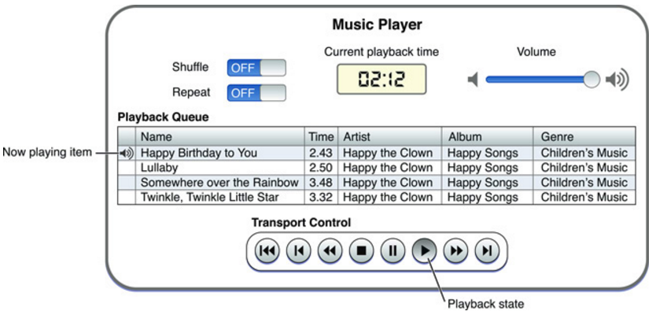

# 播放iPod中的音乐
Media Player既然叫做“Player”那必然是提供播放媒体的功能的，实际上其既可以播放视频也可以播放音频，Media Player提供的“MPMusicPlayerController”实现了一个传统播放的基本功能。比如：

图中可以看到有：  

* 当前播放曲目
* 当前播放时间
* 声音
* 下一曲
* 播放/暂停
* 循环方式

## 1.使用MPMusicPlayerController播放音乐列表

### 创建MPMusicPlayerController对象
MPMusicPlayerController分成两种类型：
* 应用级别（application music player）：应用独立的，不会影响其他音乐播放App的播放
* 系统级别（system music player）：调用系统的“音乐” App来播放，不会出界面

通过调用`+ applicationMusicPlayer`创建一个应用级别的“MPMusicPlayerController”；通过调用`+ systemMusicPlayer`获取系统内建的“MPMusicPlayerController”也就是系统的“音乐”App。

### 设置播放列表
获得了“MPMusicPlayerController”之后，就可以设置播放列表了。还记得之前[2.1 获取iPod资源信息](../mediaplayer/ipod.html)中介绍的“MPMediaQuery”和“MPMediaItemCollection”，分别是通过系统选择界面和查询条件查询的方式得到的结果。这里设置播放列表有两种方法，分别对应上面的两种结果：

* - (void)setQueueWithQuery:(MPMediaQuery *)query ： 直接传入一个过滤后的查询结果
* - (void)setQueueWithItemCollection:(MPMediaItemCollection *)itemCollection ： 传入一个MPMediaItem的集合

### 设置播放属性
在播放之前我们还可以通过一些属性值来控制播放行为

* playbackState 播放状态，只读属性
	
枚举| 模式
---|---
MPMusicPlaybackStateStopped | 停止
MPMusicPlaybackStatePlaying | 正在播放
MPMusicPlaybackStatePaused  | 暂停
MPMusicPlaybackStateInterrupted | 被挂起，比如打电话来了
MPMusicPlaybackStateSeekingForward | 前进
MPMusicPlaybackStateSeekingBackward  | 后退
	
* repeatMode 循环模式
	
枚举 | 模式
---|---
MPMusicRepeatModeDefault | 默认模式，上次的模式记忆
MPMusicRepeatModeNone | 不循环
MPMusicRepeatModeOne | 单曲循环
MPMusicRepeatModeAll | 全部循环
	
* shuffleMode 随机模式
	 
枚举|模式
---|---
MPMusicShuffleModeDefault | 默认模式，上次记忆模式
MPMusicShuffleModeOff | 不随机
MPMusicShuffleModeSongs | 所有歌曲
MPMusicShuffleModeAlbums | 按照专辑
	
### 播放控制
MPMusicPlayerController实际上是实现了协议“MPMediaPlayback”：
	
	@protocol MPMediaPlayback

	// Prepares the current queue for playback, interrupting any active (non-mixible) audio sessions.
	// Automatically invoked when -play is called if the player is not already prepared.
	- (void)prepareToPlay;
	
	// Returns YES if prepared for playback.
	@property(nonatomic, readonly) BOOL isPreparedToPlay;
	
	// Plays items from the current queue, resuming paused playback if possible.
	- (void)play;
	
	// Pauses playback if playing.
	- (void)pause;
	
	// Ends playback. Calling -play again will start from the beginnning of the queue.
	- (void)stop;
	
	// The current playback time of the now playing item in seconds.
	@property(nonatomic) NSTimeInterval currentPlaybackTime;
	
	// The current playback rate of the now playing item. Default is 1.0 (normal speed).
	// Pausing will set the rate to 0.0. Setting the rate to non-zero implies playing.
	@property(nonatomic) float currentPlaybackRate;
	
	// The seeking rate will increase the longer scanning is active.
	- (void)beginSeekingForward;
	- (void)beginSeekingBackward;
	- (void)endSeeking;
	
	@end
	
这些接口主要就是用来控制播放流程的：
* play : 开始播放
* pause : 暂停
* stop : 停止
* beginSeekingForward ： 快进
* beginSeekingBackward ： 快退
* currentPlaybackRate： 播放速率、快进/快退速率

除此之外MPMusicPlayerController还扩展了三个控制接口：

* - skipToNextItem ： 下一曲
* - skipToBeginning ： 第一曲
* - skipToPreviousItem ： 上一曲

## 2. 使用MPVolumeView设置音量
本来MPMusicPlayerController是提供一个`volume`的属性接口来控制音量的，但是在iOS7之后，这个就被“Deprecated”（如今微信/QQ都是要求iOS7及以上的时代，这个`volume`真可以寿终正寝了）。现在实现这个功能的是“MPVolumeView”这个工具。

“MPVolumeView”从其名称可以看出来他是一个带有既定UI的工具组件，外形是一个表示音量的SliderBar，可以认为是系统的音量键。

MPVolumeView作为一个完整的组件，如果是简单的使用，上面图中的一个Slider就可以控制音量的高低了。拖一个UIView到storyborard上，然后设置类型为"MPVolumeView"即可。

MPVolumeView的可用接口非常少，也就是其定制化非常有限。也就是能定制下滚轮的图片和背景形状。
首先来看两个控制显示的属性接口：

* showsVolumeSlider ： 是否显示Slider
* showsRouteButton ： 是否显示滑动轮

正常情况肯定都是显示啦。关键是不想用系统的那个滚轮和背景。"MPVolumeView"提供了`- setRouteButtonImage:forState:`来设置滑动轮的图片。接口很简单，就是对enalbed/disabled/highlighted等状态设置一个UIImage 对象。

### 使用自己的View
但是有时时候这样任然不能满足我们的需求（设想下QQ音乐里面的音量按钮）。那怎么办呢？

这时可以考虑一些黑科技，通过OC的class.description可以获得类名。MPVolumeView有三个subview，其中私有类（无法手动创建，也无法使用isKindOfClass方法）MPVolumeSlider用来控制音量大小，继承自UISlider，通过修改Slider的值就等同于设置系统的音量了。

	for (UIView *view in [mpVolumeView subviews]){
	    if ([view.class.description isEqualToString:@"MPVolumeSlider"]){
	        volumeViewSlider = (UISlider*)view;
	        break;
	    }
	}
	
	// retrieve system volume
	float systemVolume = volumeViewSlider.value;
	
	// change system volume, the value is between 0.0f and 1.0f
	[volumeViewSlider setValue:1.0f animated:NO];

	// reset system volume
	[volumeViewSlider setValue:systemVolume animated:NO];
	
这样，我们可以按照策划需求绘制一个自己的音量控制View，然后在创建一个MPVolumeView但是不显示他，或者放到屏幕外面去。当用户调整音量时，设置这个slider的值就可以实现调整音量了。

## 获取下一曲、音量等变化信息
上面的MPMusicPlayerController在播放音乐列表的时候，如何获得当前播放的曲目来显示其播放信息呢？MPMusicPlayerController提供了属性方法：

* nowPlayingItem ： 当前正在播放的MPMediaItem
* indexOfNowPlayingItem : 当前正在播放的MPMediaItem的

通过这两个方法可以获取当前播放音乐的信息，但是如何知道当前歌曲切换了呢？MPMusicPlayerController还为我们提供了三个通知：

* MPMusicPlayerControllerPlaybackStateDidChangeNotification : 当播放状态改变时，如停止、正在播放
* MPMusicPlayerControllerNowPlayingItemDidChangeNotification ： 当切换歌曲时
* MPMusicPlayerControllerVolumeDidChangeNotification : 当音量改变时

如：

    NSNotificationCenter *notificationCenter = [NSNotificationCenter defaultCenter];
    
    [notificationCenter  addObserver: self
                            selector: @selector (onVolumeChange:)
                                name: MPMusicPlayerControllerVolumeDidChangeNotification
                              object: _appMusicPlayer];
    [notificationCenter  addObserver: self
                            selector: @selector (onStateChange:)
                                name: MPMusicPlayerControllerPlaybackStateDidChangeNotification
                              object: _appMusicPlayer];
    [notificationCenter  addObserver: self
                            selector: @selector (onNowPlaying:)
                                name: MPMusicPlayerControllerNowPlayingItemDidChangeNotification
                              object: _appMusicPlayer];
	
	  // take of this
    [_appMusicPlayer beginGeneratingPlaybackNotifications];
    
	  #pragma mark Notifaction
		- (void) onStateChange: (NSNotification*) notification {
		    NSLog(@"onStateChange");
		}
		
		- (void) onNowPlaying: (NSNotification*) notification {
		    NSLog(@"onNowPlaying");
		    MPMusicPlayerController *player = notification.object;
		    MPMediaItem *item = [player nowPlayingItem];
		    NSLog(@"now playing %@", [item valueForKey:MPMediaItemPropertyTitle]);
		}
		
		- (void) onVolumeChange: (NSNotification*) notification {
		    NSLog(@"onVolumeChange");
		}
	
注意，这里需要调用MPMusicPlayerController的`
- beginGeneratingPlaybackNotifications`才能在需要的时候发送通知。当不需要的时候调用`- endGeneratingPlaybackNotifications`进行取消,同时也需要调用NSNotificationCenter的removeObserver。

文中Demo可以在[GitHub](https://github.com/cz-it/play_and_record_with_coreaudio/tree/master/mediaplayer/example/mpdemo)找到。
