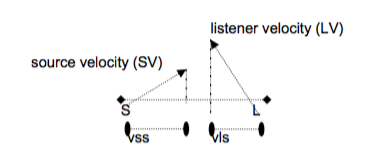

# 3D效果营造
根据前面的两章节的介绍，已经了解了如何通过OpenAL播放一个WAV文件或者说是播放一段PCM数据，当我们要播放其他格式的音频数据时，只要将其解压出得到PCM数据再进行播放即可。那要如何营造出3D效果。这就需要用到前一篇文中介绍的各种属性的设置了。

首先来看个Demo，在Demo中有两个播放按钮，第一个播放按钮按下时，会播放一段汽车鸣笛的声音，并且声音会渐行渐远。而当第二个播放按钮按下时，会同时播放出一段犬吠的声音，两个声音同时被混合播出。

Demo地址见[GitHub](https://github.com/cz-it/play_and_record_with_coreaudio/tree/master/openal/examples/OpenALCarGoDemo)

## 3D立体音
3D音效实际上就是在一个3D坐标比如笛卡尔坐标中，摆放不同的声源发声源，然后听众听到的声源是在一个3D空间中的坐标。OpenAL通过坐标和朝向来表示3D的空间描述。

首先Source和Listener都是有坐标的，比如(x, y, z)这样的笛卡尔坐标系中的一点，然后每个Source和Listener都有一个朝向，对于Source可以想象成一个喇叭的朝向，而对于Listener可以想象成耳朵的朝向，通过函数：

	void AL_APIENTRY alSource3f( ALuint sid, ALenum param, ALfloat value1, ALfloat value2, ALfloat value3 ) 
设置AL_POSITION属性，可以设置Source的坐标位置。设置AL_DIRECTION属性可以设置其朝向。而通过函数：

	void AL_APIENTRY alListener3f( ALenum param, ALfloat value1, ALfloat value2, ALfloat value3 )

设置AL_POSITION属性，可以设置Listener的坐标位置。设置AL_DIRECTION属性可以设置其朝向。类似如下的效果：

	
	

## 移动声源
有了三维坐标中的声源，那要如何构造3D动感呢？在笛卡尔坐标中，我们只要不停的改变声源的位置也就可以实现声音渐行渐远的效果了。

这里我们定义一个Timer：

	_ms100Timer = [NSTimer scheduledTimerWithTimeInterval:0.1 target:self selector:@selector(timer_100ms:) userInfo:nil repeats:YES];
	
触发动作为：

	- (void) timer_100ms: (id) sender {
	    float srcPost[3] = {0};
	    float velocity[3] = {1, 0, 0};
	    alGetSource3f(carSource, AL_POSITION, &srcPost[0], &srcPost[1], &srcPost[2]);
	    
	    for (int i=0; i<3; i++) {
	        srcPost[i] += velocity[i];
	    }
	    alSource3f(carSource, AL_POSITION, srcPost[0], srcPost[1], srcPost[2]);
	}
没100ms改变一次汽车声源的位置，在x轴上移动。

然后再播放的时候，就可以听到汽车鸣笛声越来越远的效果了。

## N+1立体音效
要实现同时播放多个音频，并进行混音，只要为创建多个Source就可以。并为每个Source设置填充要播放的音源的数据的Buffer。这里我们分别用两个WAV文件创建两个Buffer并用这两个Buffer来填充到Source中。

	-(BOOL) initBuffers{
	    /** car **/
	    alGenBuffers(1, &carBuffer);
	    if (alGetError() != AL_NO_ERROR) {
	        return NO;
	    }
	    
	    void *data= NULL;
	    size_t size;
	    size_t freq;
	    load_wav_file([[[NSBundle mainBundle] pathForResource:@"car" ofType:@"wav"] cStringUsingEncoding:NSUTF8StringEncoding], &data, &size, &freq);
	    alBufferData(carBuffer, AL_FORMAT_MONO16, data, size, freq);
	    
	    ALenum error;
	    if ((error=alGetError()) != AL_NO_ERROR) {
	        NSLog(@"alBufferData error");
	    }
	    
	    /** dog **/
	    alGenBuffers(1, &dogBuffer);
	    if (alGetError() != AL_NO_ERROR) {
	        return NO;
	    }
	    
	    load_wav_file([[[NSBundle mainBundle] pathForResource:@"dog" ofType:@"wav"] cStringUsingEncoding:NSUTF8StringEncoding], &data, &size, &freq);
	    alBufferData(dogBuffer, AL_FORMAT_MONO16, data, size, freq);
	    
	    if ((error=alGetError()) != AL_NO_ERROR) {
	        NSLog(@"alBufferData error");
	    }
	    
	    return YES;
	}
	
	-(BOOL) initSource {
	    ALenum error ;
	    /** car **/
	    alGenSources(1, &carSource);
	    if (alGetError() != AL_NO_ERROR) {
	        NSLog(@"alGenSources(1, &carSource)");
	        return NO;
	    }
	    
	    alSource3f(carSource, AL_DIRECTION, -1, 0, 0);
	    alSource3f(carSource, AL_POSITION, 0, 0, 0);
	    alSourcei(carSource, AL_BUFFER, carBuffer);
	    
	    /** dog **/
	    alGenSources(1, &dogSource);
	    if (alGetError() != AL_NO_ERROR) {
	        NSLog(@"alGenSources(1, &dogSource");
	        return NO;
	    }
	    
	    alSource3f(dogSource, AL_DIRECTION, -1, 0, 0);
	    alSource3f(dogSource, AL_POSITION, 0, 0, 0);
	    alSourcei(dogSource, AL_BUFFER, dogBuffer);
	    if (alGetError() != AL_NO_ERROR) {
	        NSLog(@"alSourcei error");
	        return NO;
	    }
	
	    return YES;
	}
	
这里依旧使用我们提供的WAV解析函数`load_wav_file`来加载WAV文件。然后调用`alBufferData`将文件加载到Buffer中，最后调用`alSourcei `将带有数据的Buffer关联到Source上。

## 总结	
OpenAL的关键是理解其设定的笛卡尔坐标系，通过设计每个声源在坐标中的位置，每个声源的朝向以及听众的位置和朝向，就可以构造一个3D空间的声源。通过增加声源，便可以实现3+1/5+1等n+1立体音效了。
## 参考
1. [OpenAL_Programmers_Guide](https://www.openal.org/documentation/OpenAL_Programmers_Guide.pdf) 
