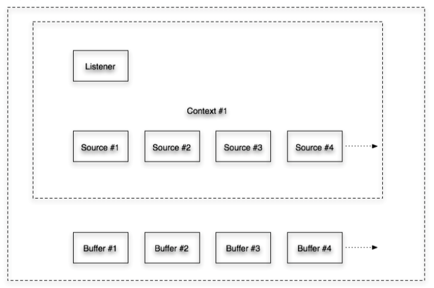

# 播放裸数据

OpenAL作为音效库，并不包含编解码的功能，所以在使用OpenAL的时候，需要我们预先将音频数据解码成PCM格式裸数据，然后才能由OpenAL进行播放。这里我们的Demo演示了用OpenAL播放一个WAV文件的功能：

点击播放按钮后开始播放，再次点击，暂停播放。

Demo的代码参见[GitHub](https://github.com/cz-it/play_and_record_with_coreaudio/tree/master/openal/examples/OpenALPlayerDemo)。

## OpenAL设计的场景框架

OpenAL构建的音频场景是有一个或者多个的声源（Source）和一个或者多个接受端听众（Listener）来架构的，通过改变声源和收听者的物理位置，从而实现3+1、5+1、N+1等3D音频效果。

听众作为接受端，只要设置其物理位置就可以了。而作为声源是从哪里获得音频数据呢？答案是Buffer，通过Buffer将数据输送给数据源，从而进行播放。

具体的播放动作，还需要使用物理设备，所以声源和听众都是基于设备的。那如何组织声源和听众呢？OpenAL又抽象出一个Context的概念，一个Context可以认为是在一个具体的设备上（比如iPhone的扬声器）上的一个声音场景。所以最后的描述就是：

> OpenAL 声源场景：在一个物理设备（Device）上通过若干个声音数据的Buffer和若干个声源（Source）以及若干个听众（Listener）组成的一个个发声场景（Context）

## Device
在使用OpenAL之前，首先我们需要获得硬件设备，在iOS上，因为只能进行播放，所以也就只需要关心播放就可以了。标准的OpenAL提供了一个罗列所有设备的方法：

	- (void) enumDevices {
	    ALboolean enumeration;
	    
	    enumeration = alcIsExtensionPresent(NULL, "ALC_ENUMERATION_EXT");
	    if (enumeration == AL_FALSE) {
	        NSLog(@"iOS dosn't support ALC_ENUMERATION_EXT");
	        return;
	    }
	    
	    ALCchar * devices = alcGetString(NULL, ALC_DEVICE_SPECIFIER);
	    //ALCchar * devices = alcGetString(NULL, ALC_DEFAULT_ALL_DEVICES_SPECIFIER);
	    const ALCchar *device = devices, *next = devices + 1;
	    size_t len = 0;
	    
	    NSLog(@"Devices list:\n");
	    while (device && *device != '\0' ) {
	        NSLog(@"    -> %s", device);
	        len = strlen(device);
	        device += (len + 1);
	        next += (len + 2);
	    }
	}

首先调用`alcIsExtensionPresent `这个方法判断当前的“OpenAL实现”是否支持后面的枚举操作，当然iOS是支持的，这里为了上下文完整也就加上了。然后调用 `alcGetString `获得类似"Default Speaker Microphone"类似这样的字符串，进行遍历逐个输出。

在iOS上的结果是只有一个“Default”的设备:

	Default Audio Device
所以，在iOS上使用的时候，我们只需要调用：

	defaultDevice = alcOpenDevice(NULL);	
传入“NULL”	从而打开那个唯一的默认设备即可。

打开了设备，根据上面说的场景，我们需要构建一个播放声音的上下文场景：

    mainContext = alcCreateContext(defaultDevice, NULL);
    if (NULL == defaultDevice) {
        return NO;
    }
    if( !alcMakeContextCurrent(mainContext) ) {
        return NO;
    }	
    
首先调用`alcCreateContext `用上面的Device创建一个Context，然后在调用`alcMakeContextCurrent `将这个Context激活为当前的上下文。

## 出错处理

这里看OpenAL的API，还是比较类似C的风格，设备和上下文的接口通过判断返回值是否为NULl是可以判断调用是否成功的，但是OpenAL的API中，除了这种返回对象指针的接口，还有大量的无返回值的接口，这样的接口要如何判断成功与否呢？OpenAL提供了类似检查errno的方式来检查：

	if (alGetError() != AL_NO_ERROR) {
        return NO;
   }
通过`alGetError ()`获得类似errno的值，然后进行判断：

错误码 | 十进制值| 十六进制| 意义
---|---|---|---
AL_INVALID_NAME||0xA001| 参数错误
AL_INVALID_ENUM | | 0xA002| 枚举参数错误
AL_INVALID_VALUE| | 0xA003 | 枚举值错误
AL_INVALID_OPERATION| | 0xA004|不适合的操作
AL_OUT_OF_MEMORY | | 0xA005| 内存越界

## Buffer
接着我们要从WAV中读取PCM数据来填充到Buffer中供Source声源使用。Demo中我们借助了我们自己实现的WAV解析工具，从WAV中解析出来具体的PCM数据、采样率以及数据位深度值。

    alGenBuffers(1, &buffers); // only one buffer
    if (alGetError() != AL_NO_ERROR) {
        return NO;
    }
首先调用 `alGenBuffers`生成一个buffer对象，并检查错误，然后调用我们自己的WAV解析函数：

	int load_wav_file(const char *file, void **data, size_t *size, size_t *freq)
获得WAV文件的PCM内容以及采样率。接着调用：

	  alBufferData(buffers, AL_FORMAT_MONO16, data, size, freq);
    
    ALenum error;
    if ((error=alGetError()) != AL_NO_ERROR) {
        NSLog(@"alBufferData error");
    }
    
`alBufferData `将PCM数据装载到buffer中。

## Source
设置好了音频数据Buffer以后，我们创建一个声源并为其装载上数据：

    alGenSources(1, &sources); // only one source
    if (alGetError() != AL_NO_ERROR) {
        return NO;
    }
这里调用 `alGenSources ` 创建一个Source对象。接着调用：

    alSourcei(sources, AL_BUFFER, buffers);
    if (alGetError() != AL_NO_ERROR) {
        return NO;
    }
将Buffer绑定到Source之上。

## Listener
默认Context情况下，OpenAL就已经提供了一个一个Listener，为了最简单跑通流程，我们可以先不用关心这个，直接使用默认对象。

## 播放和暂停

一切都准备好后，我们就可以开始进行播放了：

    alSourcePlay(sources);
    ALenum error;
    if ((error = alGetError() )!= AL_NO_ERROR) {
        NSLog(@"play error with %d", error);
        return;
    }
通过调用 `alSourcePlay `  播放指定的声源。同样的，通过：

    alSourceStop(sources);
    ALenum error;
    if ((error = alGetError() )!= AL_NO_ERROR) {
        NSLog(@"stop error with %d", error);
        return;
    }
调用`alSourceStop `停止指定声源的播放。

## 资源回收

最后因为OpenAL提供的是C接口，而不是OC接口，不能依赖ARC进行内存管理。所以当使用完之后还需要调用：

    alDeleteSources(1, &sources);
    
    alDeleteBuffers(1, &buffers);

    ALCdevice *device = alcGetContextsDevice(mainContext);

    alcMakeContextCurrent(NULL);

    alcDestroyContext(mainContext);

    alcCloseDevice(device);

依次回收Source/Buffer/Context并关闭Device。

## 总结
这里通过一个最简单的例子，演示了OpenAL的设计模式以及使用方法。通过播放一段WAV文件，熟悉了OpenAL提供的Device/Buffer/Source/Listener这几个关键概念。虽然可以播放声音了，但是OpenAL的功能远不如此，通过设置Source和Listerner的位置、移动等属性，我们可以营造一个非常丰富的3D音效效果。

## 参考

1. [OpenAL short example](https://ffainelli.github.io/openal-example/)
2. [Play Compressed Formats With OpenAL](http://kcat.strangesoft.net/openal-tutorial.html)
3. [OpenAL_Programmers_Guide](https://www.openal.org/documentation/OpenAL_Programmers_Guide.pdf) 